# Git Bush 使用手順
ここでは、gitを使用してファイル編集、プルリクエストからマージまでの操作を説明します。
github やブランチの考え方の説明については別途。
1. gitbush を起動
- git clone でリポジトリをコピーしたフォルダで右クリック → Open Git Bush here を選択 で Git Bush を起動
 - 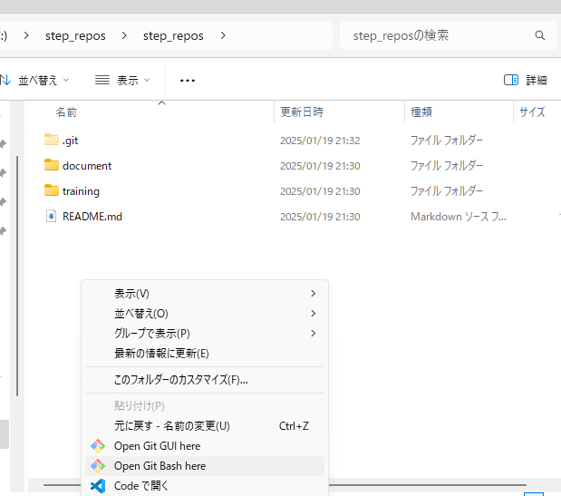
2. 作業用ブランチの作成
- 初回は main ブランチ(原本のブランチ)で起動されるので、以下のコマンドで最新のリソースを取得する
 - 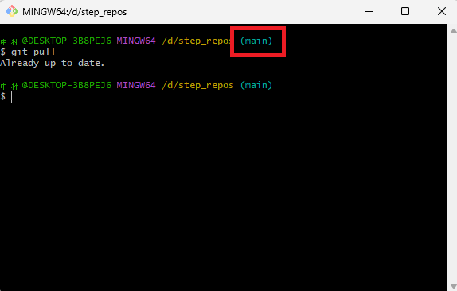
```
git pull
```
- main ブランチをベースに、以下のコマンドで作業用のブランチを作成する
 - 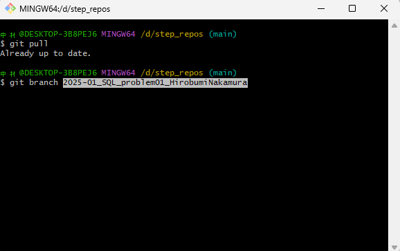
```
git branch [ブランチ名]
```
- 以下のコマンドで、作成したブランチにチェックアウトする
 - 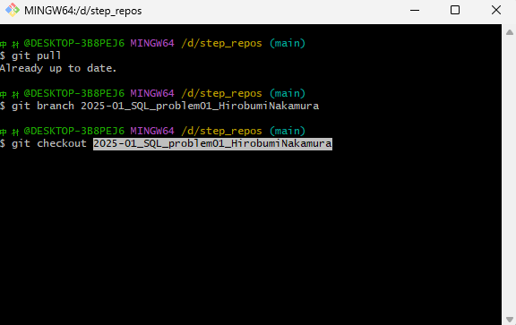
```
git checkout [ブランチ名]
```
ここからは、チェックアウトしたブランチのファイルに編集をかけていきます

3. 編集作業
  ここから、以下の問題１をベースに説明していきます。  
  https://github.com/HirobumiNakamura/step_repos/blob/main/training/2025-01_SQL/problem01.md
- 課題の答えを記載するためのmdファイル（マークダウンファイル）を配置します
 - 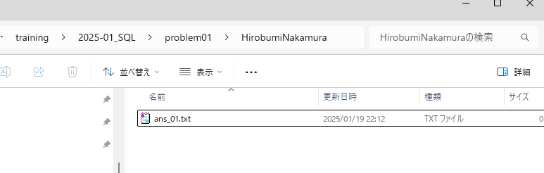
- SSMSを起動して、問題１の回答SQLを実行します。
 - 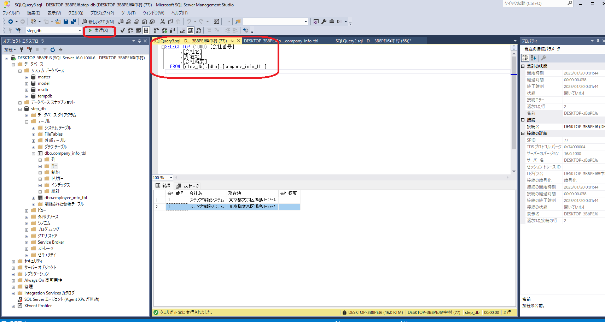
- INSERT、UPDATE、DELETE文の場合は結果を確認するためのSQLを実行します。
 - 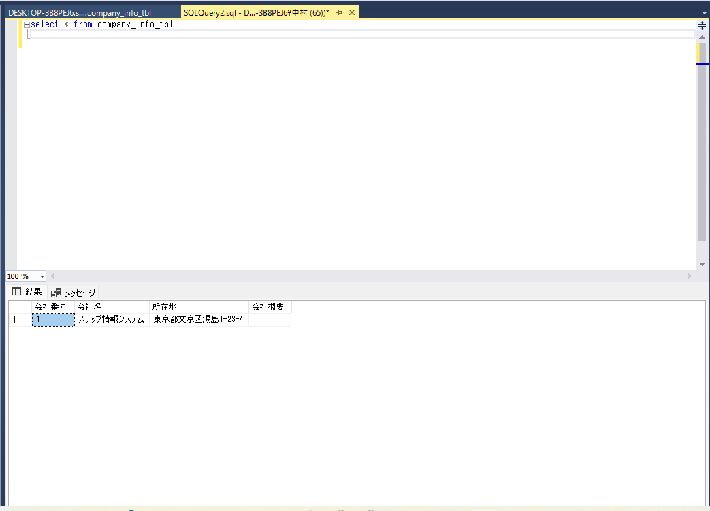
- 結果を確認して、OKなら結果を右クリック → ヘッダー付きでコピーを選択して、結果を保持します。
 - 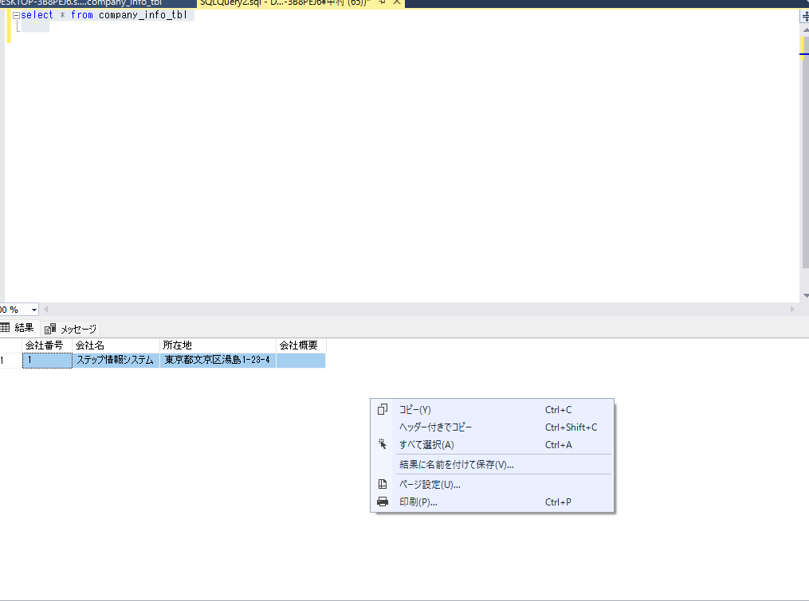
- 以下のファイルを参考に、問題の答えと確認結果を張り付けてください。そのままコピーして、バッククォート３つに囲まれている箇所を変更すると良いです
https://github.com/HirobumiNakamura/step_repos/blob/main/training/2025-01_SQL/problem01/HirobumiNakamura/ans_01.md

4. 作業ブランチの反映
- ファイルの追加・修正・削除が行われた場合、以下のコマンドで変更したフォルダ・ファイルが赤く表示されます
 - 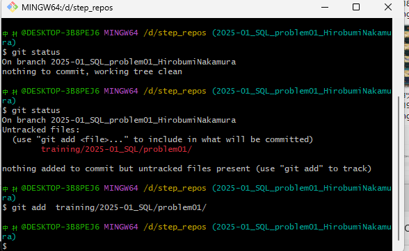
```
git status
```
- 変更したファイルをインデックスに登録します。  
インデックスとはコミット前の変更を一次的に保存する場所です
 - 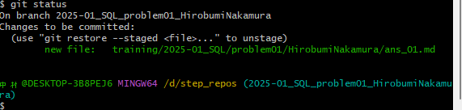
```
git add [変更したフォルダ・ファイル]
```
- 変更したファイルをコミットします
 - 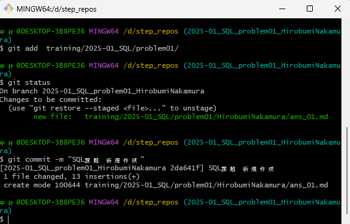
```
git commit -m "[コミットコメント]"
```
- ローカルリポジトリの変更をリモートリポジトリにpushします
 - 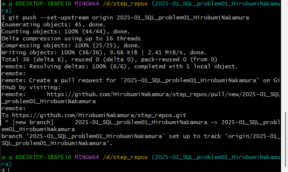
```
 git push --set-upstream origin [作業ブランチ名]
```
5. プルリクエストの作成
 ローカルリポジトリの変更をリモートリポジトリにpushすると、プルリクエストを作成できます。  
 プルリクエストとは、リモートリポジトリにpushしたブランチを、mainブランチに反映するためのリクエストです
- githubの step_repos リポジトリにアクセスして Pull requests をクリックすると Compare & pull request のボタンが出てくるのでクリックします
 - 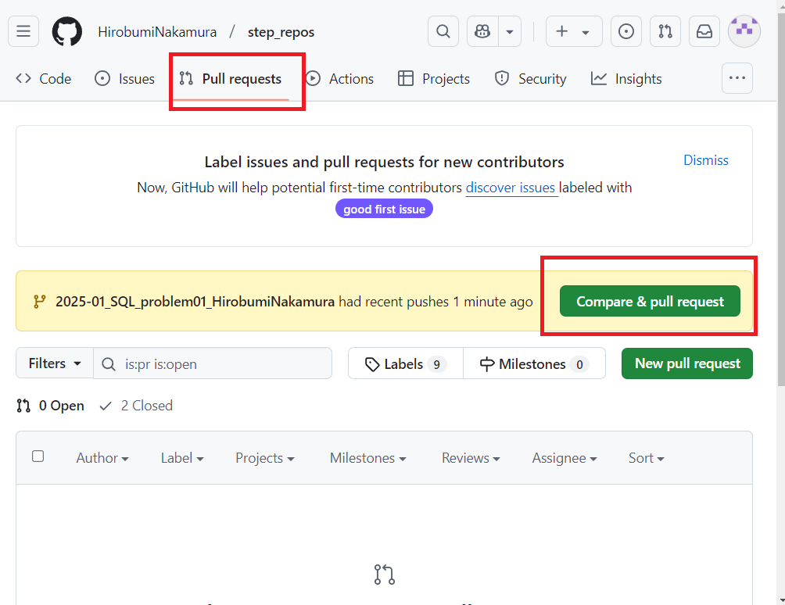
- タイトルと説明を記載して、Create Draft pull request（開発途中のプルリクエスト） を クリックします
この作業で、他の人からも自分の編集内容が確認できるようになります。
 - 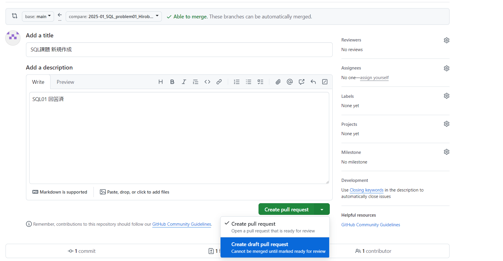
- 他の課題も実施して、[3. 編集作業][4. 作業ブランチの反映]を繰り返します。作業が完了したら Ready for review をクリックして、PRをOpenにします
 - 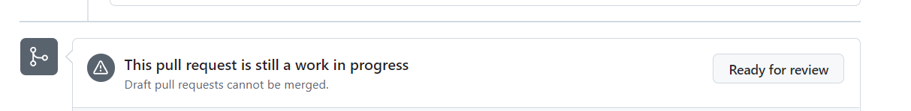
 - 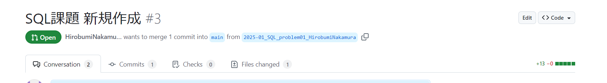
- この状態になると、課題は終わりましたということになるので、有識者にチェックしてもらいます。
　以下の画像のように、修正箇所と、修正内容を提示されるので、必要に応じて修正してください。
 - 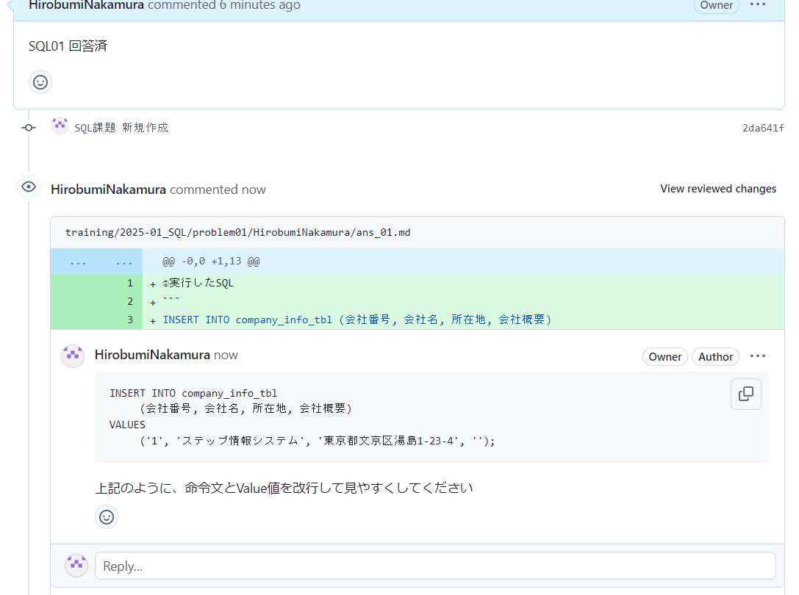
- 一通り修正が終わり、有識者に承認(approve)をもらえたら main ブランチにマージします
　これ以降の作業は有識者の指示にしたがって作業してください  
　※基本的に作業者が勝手にマージすることは業務上レアケースですが、今回は練習なのでマージします。  
　Merge pull request をクリックしてください
 - 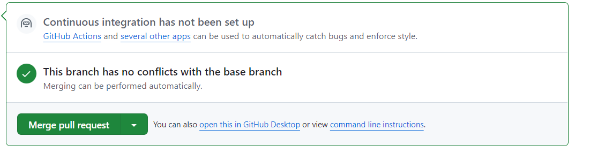
 - 
- main ブランチにマージされ、他の人からもこのファイルが触れるようになりました
  - 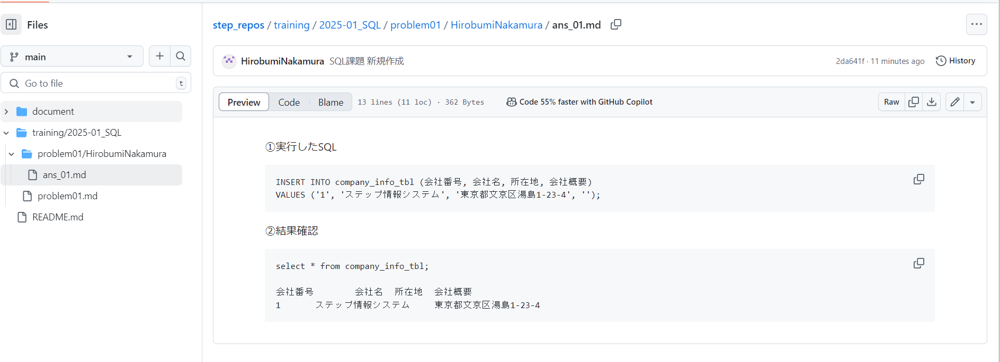


