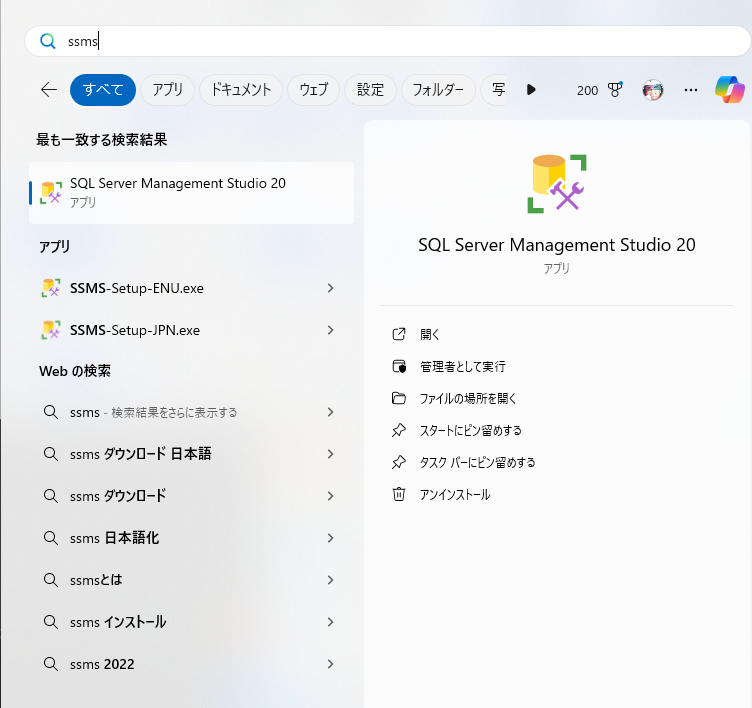
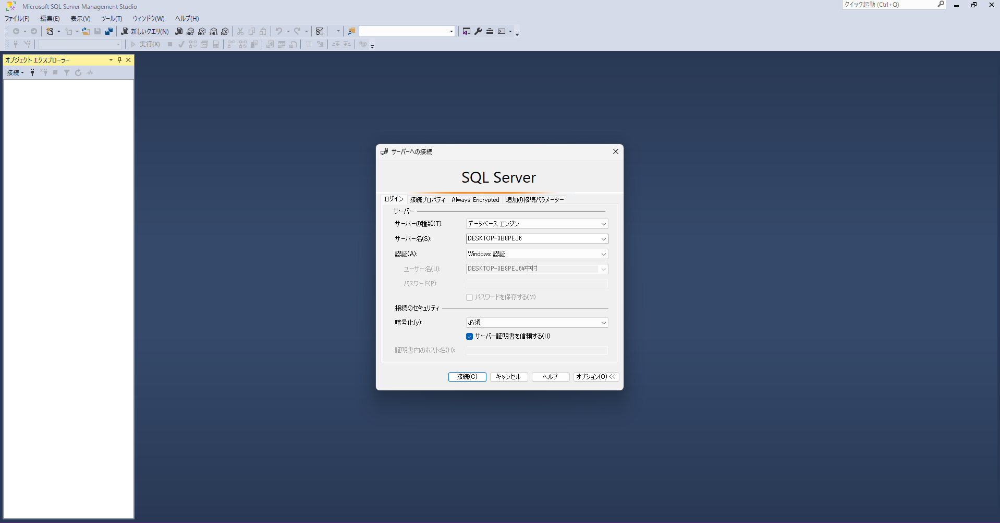
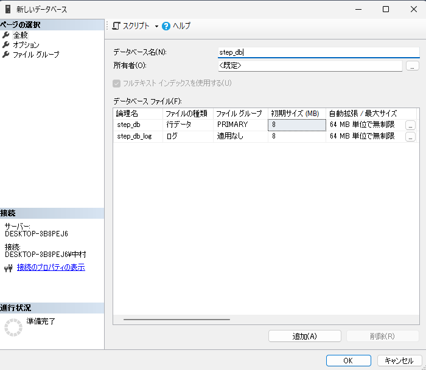
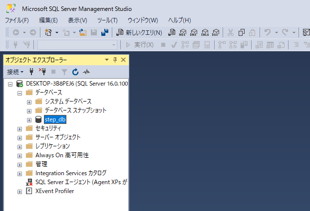
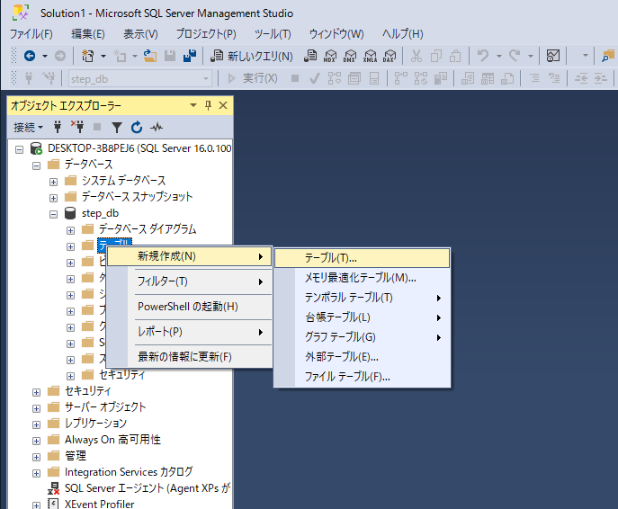
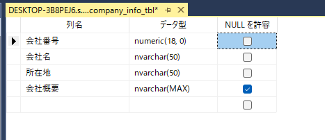
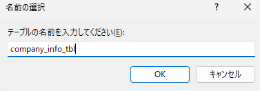
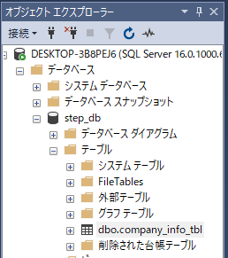
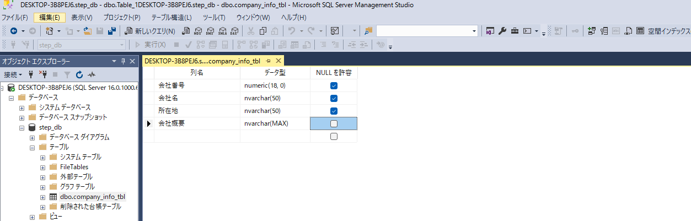
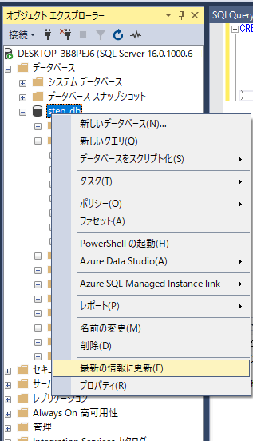

# SSMS 使用手順
1. SSMS とは  
SQL Server Management Studioの略。SSMSはSQL ServerならびにRDBを管理するための統合環境。

2. DB への接続
- アプリから SSMS を起動する。 
 - 
- サーバ証明書を信頼する にチェックを入れて、接続する。 
 - 

3. SSMSを使用したテーブルの操作  
以下の情報を元に、企業情報テーブル、社員情報テーブルを作成して使用方法を説明します。  

〇企業情報テーブル (company_info_tbl)

|列名|データ型|NOT NULL|  
|---|---|---|
|会社番号|数値|〇|
|会社名|文字列|〇|
|所在地|文字列|〇|
|会社概要|文字列||

〇社員情報テーブル (employee_info_tbl)
|列名|データ型|NOT NULL|  
|---|---|---|
|社員番号|数値|〇|
|会社番号|文字列|〇|
|社員名|文字列|〇|
|性別|文字列|〇|
|住所|文字列||
|電話番号|文字列||  
|給与|数値|〇|
4. データベースを作成する
- データベースを右クリックして、新しいデータベースを選択する 
 - 
- データベース名(step_db)を入力して、OK を選択する 
 - 
- データベースツリーの下に、データベース(stepdb) が追加されていることを確認する 
 - 

5. SSMSの機能を使用してテーブルを作成する
- オブジェクト エクスプローラーより、新規作成 → テーブル を選択する
 - 
- 企業情報テーブルの内容を入力して保存する
 - 
- テーブル名を入力してOKを選択する
 - 
- オブジェクト エクスプローラーより、テーブルが作成されていることを確認する
 - 

6. クエリを使用してテーブルを作成する
- 新しいクエリ を選択する
 - 
- 社員情報テーブルのクエリを作成して、実行する
```
CREATE TABLE [dbo].[employee_info_tbl](
	[社員番号] [numeric](18, 0) NOT NULL,
	[会社番号] [numeric](18, 0) NOT NULL,
	[社員名] [nvarchar](50) NOT NULL,
	[性別] [nvarchar](50) NOT NULL,
	[住所] [nvarchar](50) NULL,
  	[電話番号] [nvarchar](50) NULL,
	[給与] [numeric](18, 0) NOT NULL,
)
```
- データベースを更新して、employee_info_tbl が追加されていることを確認する
 - 


