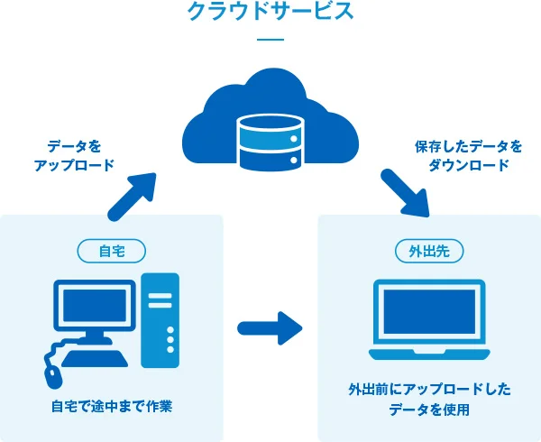

# クラウドサービス について学ぼう

### ■ はじめに
クラウドとは何かを説明するため、今回は従来のインターネットサービスであるオンプレミス、レンタルサーバとの違いを交えて説明していきます。

### ■ クラウド と クラウドサービス
クラウドとは、データをインターネット上に保管する考え方の事です。
  

一説では、インターネット上にあって実体がないサービスのイメージを表現するために、雲（クラウド）を用いて図解をしたことが、クラウドの語源といわれています。
この考え方を基に、インターネットを通じてサーバーやストレージ、ソフトウェアなどをユーザーに提供し、必要なときに必要な分だけ使用できるようにしたサービスをクラウドサービスと言います。

### ■ オンプレミス と クラウドサービス
コンピューターの利用には、データを保管しておくためのサーバーやストレージが必要です。クラウドが普及する前は、各企業でサーバーやストレージを購入し、会社の中に設置して自分たちで運用を行う「オンプレミス」という方式が一般的でした。

一方クラウドを利用する方式では、サーバーやストレージ、ソフトウェアなどの提供者（クラウドベンダー）が一括して必要な環境の準備・運用を行い、「クラウドサービス」として資源を貸し出します。借りる側はインターネットにアクセスできる端末だけを用意すればいいので、社内にサーバーやストレージを設置したり、管理したりする必要がなく、コストや手間を削減できます。インターネットにアクセスできる環境であれば、時間や場所を問わずデータを扱うことができます。

#### ■クラウドの5つの特徴
NIST（アメリカ国立標準技術研究所）では、クラウドサービスの定義として「５つの基本的な特徴」「3つのサービスモデル」「4つの実装モデル」  によって構成されます
「レンタルサーバー」は、データをインターネット上に保管するクラウドの特徴を有していますが、クラウドの5つの特徴を満たしていないため、クラウドサービスとは別物として扱われています。

#### １．オンデマンド・セルフサービス  
クラウドサービスでは、クラウドベンダーの手を借りずに容量の増減などを実行できる仕組みが整えられており、ユーザーがWeb上で自由に設定の変更を行えます。これを「オンデマンド・セルフサービス」といいます。

サーバーの容量を変更したい場合、レンタルサーバーでは追加のサーバーを契約するための手続きが必要になりますが、クラウドサービスなら「クラウドベンダーに連絡をして許可を取る」といった手間が不要です。

#### ２．幅広いネットワークサービス  
パソコンだけでなく、さまざまな端末からアクセスしてサービスを利用できることも、クラウドサービスの特徴の一つです。出張や在宅勤務、共同作業にも対応できるという利点がある一方で、インターネットに接続できない状況では使用できないという注意点があります。

#### ３．幅広いネットワークサービス 
クラウドサービスでは、サーバーなどのITリソースを複数のユーザーで共有します。余分を融通し合うかたちで成り立っているため、リソースの使用効率が最適化され、コストを抑えやすいのがメリットです。

また、ユーザーはリソースの限度については気にせず、特に制限を受けることなくサービスを利用することが可能です。

#### ４．スピーディーな拡張性
設定変更が容易なため、手続きなどの手間が削減されるだけでなく、システムの拡張や縮小（スケールアップ・スケールダウン）をスピーディーに行えるという利点につながります。

「アクセスが集中したからサーバー数を増やす」「落ち着いたから減らす」といった状況に応じた調整も可能なため、対応が遅れてビジネスチャンスを逃すこともありません。オンプレミスのように、予備のサーバーを保有しておく維持費がかかることもないため、コストは必要最低限に抑えられます。

#### ５．スピーディーな拡張性
クラウドサービスでは、CPUやストレージなどの利用量が常に計測されています。これにより、使った分だけ料金を支払う「従量課金制」が成立しています。そのため電気料金のように、ユーザー側でも利用状況の変動を把握しやすく、用途や規模に適したサービスを選んで運用していくことが可能です。

#### ■クラウドの3つのサービスモデル
「サービスモデル」とは、クラウドサービスの利用形態の種類を指します。何が提供されているのか、どんなことが可能なのかなど、それぞれに特色が異なるため、クラウドサービスを利用する際には、目的に合わせた形態のものを選ぶ必要があります。

#### １．SaaS　ソフトウェア・アズ・ア・サービス  
「SaaS」とは、インターネットを通じてソフトウェアを利用できるサービスのことです。例えばGmailやYahoo!メールのような、ソフトウェアのインストールをせずに使用できるWebメールなどは、これに当てはまります。

すでにソフトウェアとして完成されたものを利用するため、管理が不要で導入しやすい点がメリットです。その反面、独自のカスタマイズは行いにくく、セキュリティ対策もクラウドベンダーにゆだねるかたちになる点に注意が必要です。

#### ２．PaaS　プラットフォーム・アズ・ア・サービス
「PaaS」とは、アプリケーションの開発や実行に必要なプラットフォームを提供するものです。データベースの管理システムや開発支援ツールも含めて利用できるため、後述するIaaSよりも導入のハードルが低く、初期費用を抑えられます。

自由度が低いのが難点ですが、コストや手間を省いて開発・運用に集中でき、スペック変更も柔軟に行えます。提供されているサービスの範囲内で事足りるケースであれば、有効に活用できる利用形態です。

#### ３．IaaS　インフラストラクチャ・アズ・ア・サービス
「IaaS」とは、ストレージやサーバーなど、基本的なITインフラのみを提供する形態のことです。SaaS、PaaSと比べて導入のハードルは高くなりますが、自由にカスタマイズできるのが利点です。

データの保管場所であるストレージやサーバーの管理はクラウドベンダーが行いますが、IaaSを利用して開発したアプリケーションやプラットフォームについては、自分たちの手でセキュリティ対策などを行う必要があります。

#### ■クラウドの4つの実装モデル
クラウドサービスの提供形態のことです。

#### １．プライベートクラウド 
特定のユーザー専用に構築されたクラウド環境のことを指します。プライベートクラウドは、さらに自社内にオンプレミスで構築する「オンプレミス型」と、クラウドベンダーが提供するパブリッククラウド環境を区切って占有する「ホスティング型」に分けられます。特にオンプレミス型はカスタマイズの自由度が非常に高いのが特徴ですが、後述するパブリッククラウドと比較すると、コストがかかる点がデメリットです。

#### ２．パブリッククラウド 
クラウドベンダーが用意したITリソースをインターネットを介して、世界中の不特定多数のユーザーが共有する形態のクラウド環境のことを指します。基盤となるITリソースを他のユーザーと共有するため、プライベートクラウドよりも低コストで運用可能な点がメリットですが、クラウドベンダーが提供する環境をそのまま利用する都合上、カスタマイズの自由度が低い点がデメリットです。

#### ３．ハイブリッドクラウド
複数の異なる利用形態同士を組み合わせたクラウド環境のことを指します。ハイブリッドクラウドの具体的な例を挙げると、機密性の高いデータを扱う業務の基幹系システムはオンプレミス上に構築し、インターネット上に公開するWebサーバーなどの情報系システムはパブリッククラウドで構築し、これらを組み合わせて運用する、といったパターンがあります。

#### ４．ハイブリッドクラウド
特定の複数の事業者などが共同で所有あるいは運用するクラウドコンピューティング環境。業種や事業内容などが共通する複数の企業や組織が共同でデータセンターを運用し、各組織からネットワークを通じて利用します。

#### ■クラウドのメリット
オンプレミスと比較して、クラウドのメリットは以下となります。

#### １．柔軟性と拡張性
クラウドはユーザ視点ではオンプレミスのように物理的にサーバを設置、増設するわけではないため、ビジネスの成長や変化に応じて、必要なリソースを柔軟に変化させることができます。
例えば、繁忙期にはサーバの要領を増やし、閑散期には減らすといった運用でコストを減らすことが可能です。オンプレミス環境ではサーバの増築や削減に時間、物理的コストが掛かりますが、クラウドでは設定のみで変更が可能です。

#### ２．可用性と信頼性
クラウドベンダーは複数のデータセンターを持ち、冗長化されたシステムを構築しているため、障害が発生しても迅速に復旧できます。また、クラウドは24時間365日の監視体制を整えており、常に安定したサービスを提供。これにより、企業はシステムのダウンタイムを最小限に抑え、ビジネスの継続性を確保することができます。

さらに、クラウドは高いセキュリティ基準を満たしているところが多く、データの保護やプライバシーの確保において優れています。
オンプレミス環境では、OSなどの基幹部分のアップデートなどにも人的コストが掛かりますが、クラウド環境では環境全体でアップデートするため、利用者側視点ではコストがかからず、質の高いセキュリティが期待できます。

#### ３．最新技術の利用
技術革新による最先端の機能をすぐ利用できるのも、クラウドのメリットです。例えば、生成AIや深層学習、量子コンピューティングやノーコード / ローコード開発ツールなどの機能が各クラウドベンダーで提供されており、ユーザーはそれらを手軽に利用できます。

#### ■有名なクラウドサービスについて

#### １．Amazon Web Services（AWS）
世界シェアNo.1のクラウドサービス。  

特徴  
・サービス数が最多：200以上のサービスを提供  
・実績と信頼性：2006年開始で最も長い歴史、多くの大企業が採用  
・情報が豊富：日本語の解説記事、書籍が多い  

代表的なサービス  
・EC2：仮想サーバー  
・S3：ストレージ（ファイル保存）  
・RDS：データベース  
・Lambda：サーバーレス  
・CloudFront：CDN（コンテンツ配信）  

#### ２．Microsoft Azure（Azure）
Microsoftが提供するクラウドサービス。

特徴  
・Microsoft製品との連携：Windows Server、Office 365、Active Directoryとの相性抜群　　
・ハイブリッドクラウド：オンプレミスとクラウドの組み合わせに強い  
・エンタープライズ向け：大企業・官公庁での採用が多い

代表的なサービス  
・Virtual Machines：仮想サーバー  
・Blob Storage：ストレージ  
・Azure SQL Database：データベース  
・Azure Functions：サーバーレス  
・Azure AD：ID管理

#### ３．Google Cloud Platform（GCP）
Googleが提供するクラウドサービス。

特徴  
・データ分析・AI/ML：BigQuery、TensorFlowなどが強力  
・コンテナ技術：Kubernetes（GKE）の開発元  
・ネットワーク性能：Googleの高速ネットワーク  
・シンプルな料金体系：わかりやすい課金  

代表的なサービス 
・Compute Engine：仮想サーバー  
・Cloud Storage：ストレージ  
・BigQuery：大規模データ分析  
・Cloud Functions：サーバーレス  
・GKE：Kubernetesマネージドサービス  