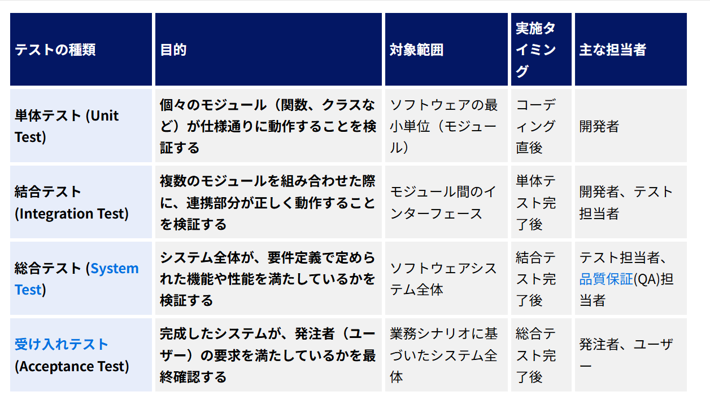
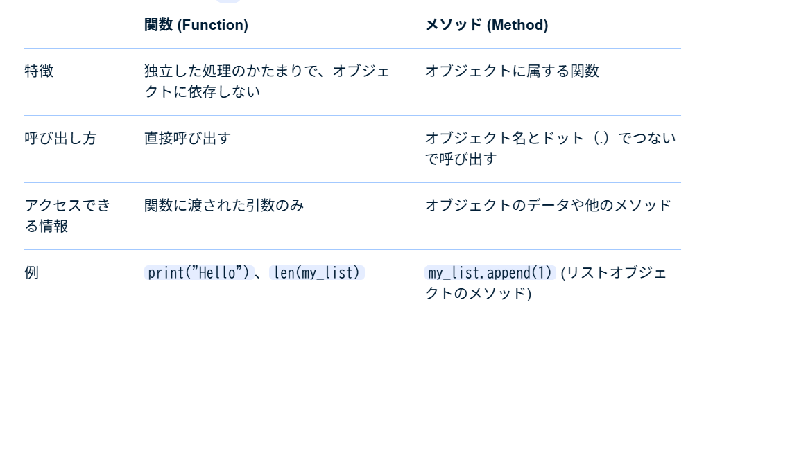
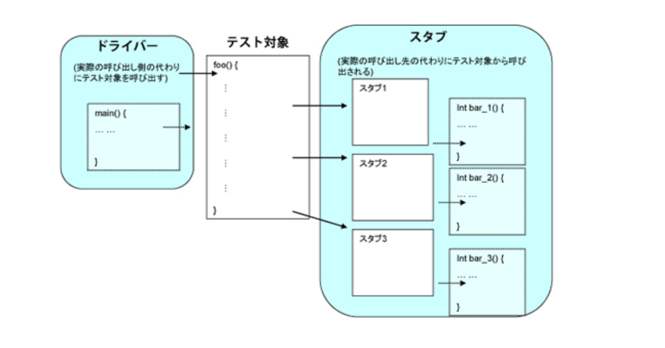

# 何故、単体テストを自動化するかを考えよう

### ■ はじめに
単体テストのやり方については、プロジェクト毎に色々な方法があると思います。  

我々プロジェクト参画者は、各プロジェクトのやり方に合わせるのは大前提ですが、単体テストについては、テストの実施方法がプロジェクト毎に特色が出やすいため、違うプロジェクトに参画した際に戸惑うこともしばしばあります。そのため本来の単体テストはどうあるべきか？というのを知識としてもっておくのは対応の幅を広げるためには必要な知識となります。


### ■ テスト工程の種類
テスト工程の種類は大きく分けて以下になります。


### ■ 単体テストとは
単体テストは「Unit（単位） Test」とも呼ばれる通り、メソッドや関数などの1つ1つの小さな単位ごとに行うテストのことです。1つの画面や1つの機能（モジュール）で実施される動作をテストすることが目的となっています。


メソッドと関数は同じものだと認識している人が多いですが、実際には以下の違いがあります。 
 

また、モジュールとはどの単位を指すの？部品と何が違うの？と言った話を聞きますが、部品、コンポーネント（ライブラリ）、モジュールとは以下を指します。
 

結論として、単体テストとは、部品（関数・メソッド）単位でプログラムを動かし、１画面または１モジュールのテストをすることを目的とします。

### ■ 単体テストの手法
①ブラックボックステスト

内部実装を知らずに入出力だけを検証
仕様書に基づいてテストケースを作成
例：add(2, 3) → 5 を返すか？

② ホワイトボックステスト

内部ロジック（分岐、ループなど）を考慮
すべての分岐を網羅するようにテスト
カバレッジ（コード網羅率）を意識

③ 境界値分析（Boundary Value Analysis）

入力の「境界値」でエラーが出やすい
例：0, 1, 99, 100（上限100の場合）

④ 同値分割（Equivalence Partitioning）

同じ結果になる入力値をグループ化
グループごとに1つずつテスト
例：1～100 → 有効、0以下・101以上 → 無効

⑤ エラーハンドリングテスト

例外処理やエラー入力への対応を確認
例：null を渡したら例外を投げるか？

### ■ 何故、テストの自動化が必要なのか？
テストの自動化が必要な理由について、すぐに思いつくのは、一度テストコードを作成してしまえば、何度でも同じテストを繰り返すことができるため、プログラムを修正したことによる再テストの工数が減ること。また人が手で実施するのではなく機械が実行するため再現性が高く、人為的なミスが防げることにあります。  

反面、テストコードの作成やメンテナンスといった工数も増えることとなるため、この点についてはプロジェクトの規模や難易度によって賛否が分かれる部分ではないかと思います。  

テストの自動化について、本来の目的はテストコードを作成することにあります。
よくある事例として、単体テストを画面を実際に操作してテストするのは一般的だと思います。しかしこのテスト方法だと、部品のテストをしたいのに、部品が呼ばれる前のロジックでいくつか入力値がはじかれてしまい、境界値分析やエラーハンドリングテストなどが実施できない場合があります。単体試験はカバレッジ100%を目標として掲げていることも多いですが、テストの目的に対し、テストの実施方法があっていないため、モジュールを動かしての試験では、カバレッジツールを通しても、通らないルートが発生してしまうため、目視で通らない部分の理由付けが必要だったりすることがあり、目的が形骸化してしまうことがあります。本来部品単位で試験していた場合はこのケースは起こりえません。

その状況を回避するために、本来はドライバ、スタブを使用してテストしますが、そのドライバにあたる部分がテストコードとなります。
 

### ■ まとめ テストコード作成のメリット
結論としてテストコード作成のメリットは以下となります。  

- 各関数、メソッド単位で試験観点に沿った試験を正しく実施できる
- 機械が実施するので再現性が保証された試験が実施できる
- コストについては、テストコード実装者の技量や開発規模によって変わるため、判断が難しい点ではある

### ■ 実践　テストコード作成
テストコード作成でよくある注意点や問題点等をまとめていきます。

- privateメソッドは呼び出せないけど、どうしたらよいの？  
 javaやC#などは、カプセル化する関係上、直接呼び出せないメソッドが存在します。
 そういった場合はリフレクションという機能を使ってテストコードを作成します。リフレクションはアセンブリからメタデータを取得できる機能です。
 [C# リフレクションについて](https://qiita.com/seiya2130/items/ea2c31d5fc5faf024f59)  
   
   リフレクションは、クラス設計そのものを無視するため使われる機会が少なく、プロジェクトによっては使用を禁止していることもありますが、テストコードに関しては基本的にこの機能を使うことは必須といえる機能です。

- テストコードを作るのがめんどくさい  
テストコードは原則として、関数を作る直前にまず1パターンは作成します。 動作確認する際にテストコードを使用することで、テストパターンの網羅は動作確認用のテストコードのコピペで済むようになります。

- 可変項目（乱数・時刻など）によって結果が変わるものは無理では？  
pythonでは、デコレータを使用して、モジュールにパッチをあてることにより、簡単にスタブを実装することが可能となっています。
以下、例を示しますが、他の言語についてもテストフレームワークを利用している場合、同じようなことができるかもしれないので探してみてください。(リフレクションを使えば同じような実装は可能)

python実装例

```
sample.py

from datetime import datetime

def func():
    return datetime.now() ←ここにパッチを当てたい
```

```
test_sample.py
from datetime import datetime
from sample import func

@mock.patch('app.sample.datetime')　← sample.pyのdatatimeが m に置き換わる
def test_func(m):
    m.now.return_value = datetime(2021, 2, 1)
    actual = func()
    assert actual == m.now()
```

- スタブはどこまで作ればよいの？  
テスト関数内で完結するのが望ましいので、本来であればテスト対象が呼び出す関数についてはスタブ化が理想ですが、現実問題としてそこまでやる必要はないです。  以下の感覚ぐらいで良いと思います。  
・外部要因によって結果が変わらないものはスタブ作成が不要  
・外部要因によって結果が変わるものはスタブ作成が必要      

  例として、外部WebAPIをよびだしている関数などは、返却値の結果が保証できないためスタブを作成して試験しないと、プログラムが変わっていないにも関わらず、時期によってテスト結果が変わったりします。DB等は内部DBであれば試験前にデータベースを削除→データ投入により返却値の担保ができるため、そのあたりを判断基準にするとよいです。部品呼び出し結果が変わらないことが前提。

