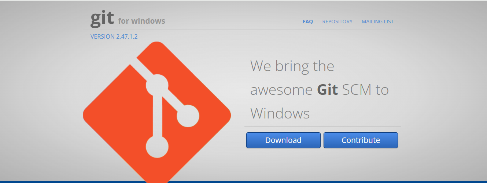
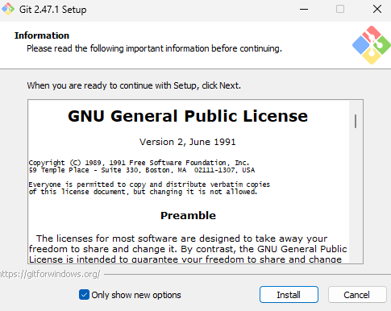
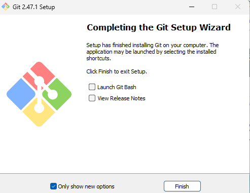
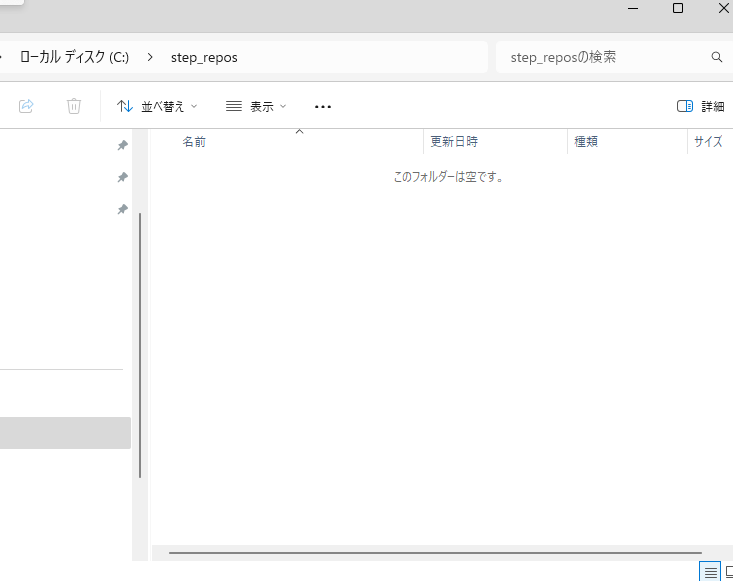
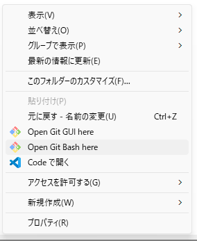
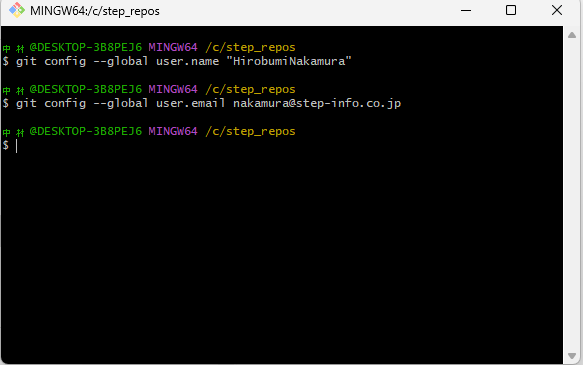
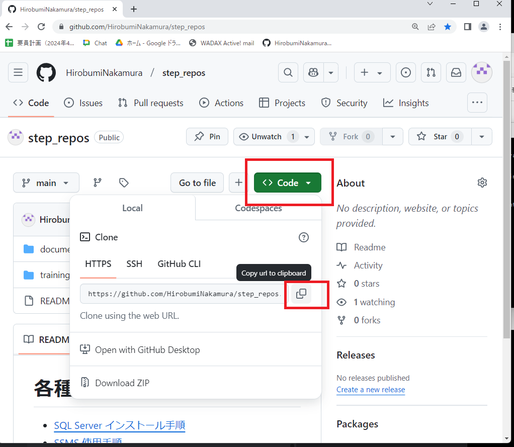
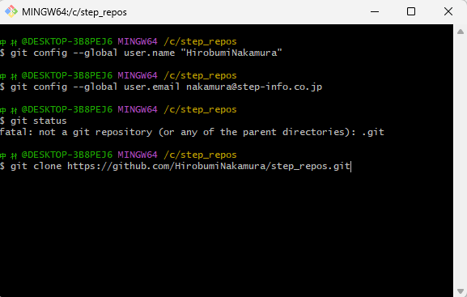
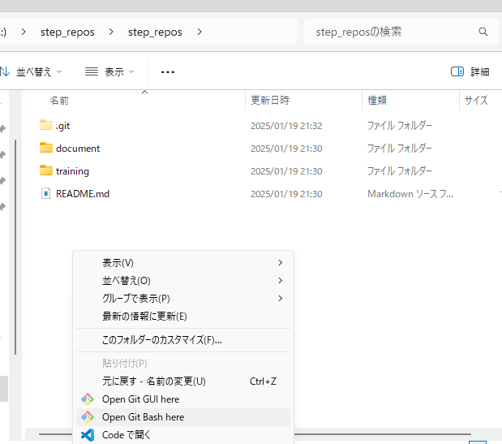

# Git Bush インストール&初期設定手順

1. ダウンロード  
https://gitforwindows.org/
- ダウンロード を選択 
  - 
2. インストール
- Only show new options にチェックをいれて install
  - 
- チェックをすべて外し Finish
  - 
3. 初期設定
- 作業用に適当なフォルダ (今回は step_repos) を作成する
  - 
- フォルダ内で右クリック → Open Git Bush here を選択 で Git Bush を起動
  - 
- ユーザとメールアドレスを登録する。
  - 
```
  git config --global user.name [gitに登録したメールアドレス]
  git config --global user.email　[gitに登録したメールアドレス]
```
- 編集対象のリポジトリのURLをコピーする  
https://github.com/HirobumiNakamura/step_repos
  - 
- git clone [コピーしたリポジトリのURL]を 実行する
  - 
- step_repos の フォルダ内に github上のファイルがコピーされるので、今後はこのファイルを編集していきます
  - 


