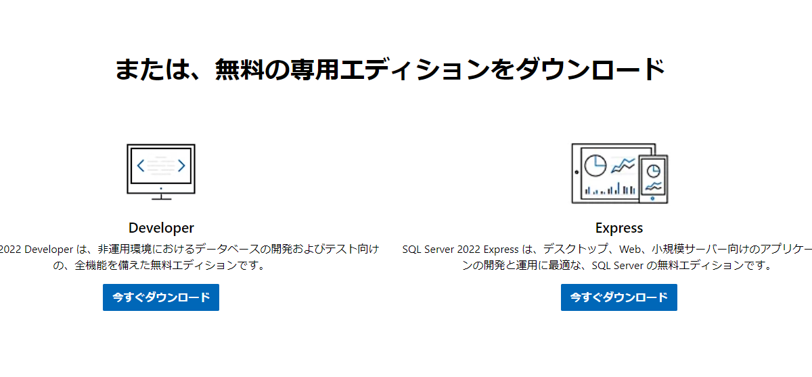
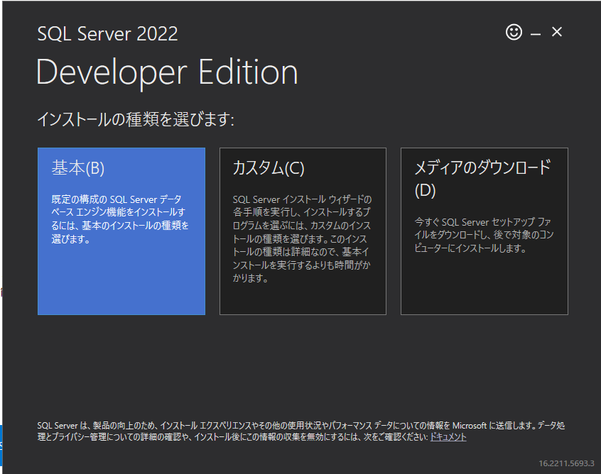
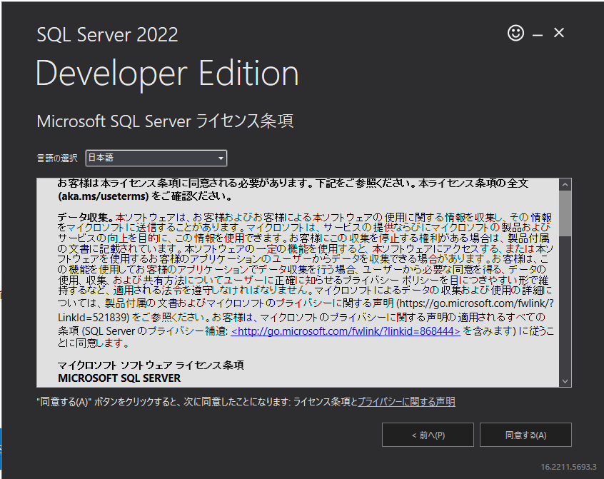
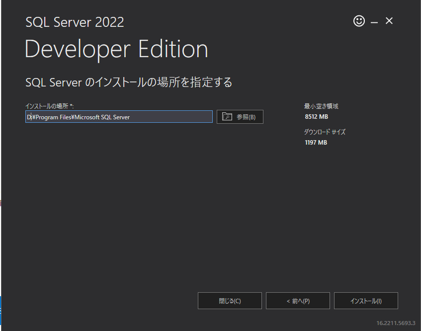
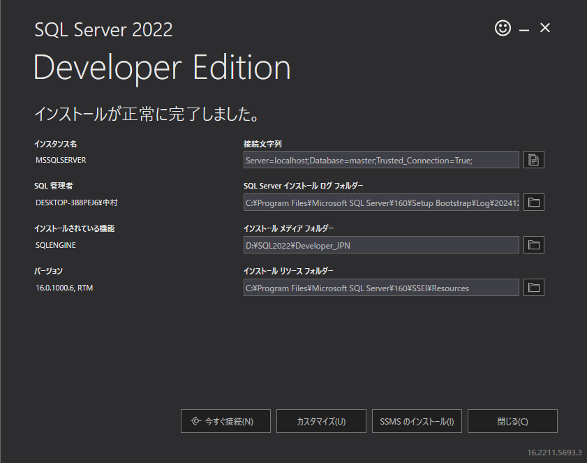
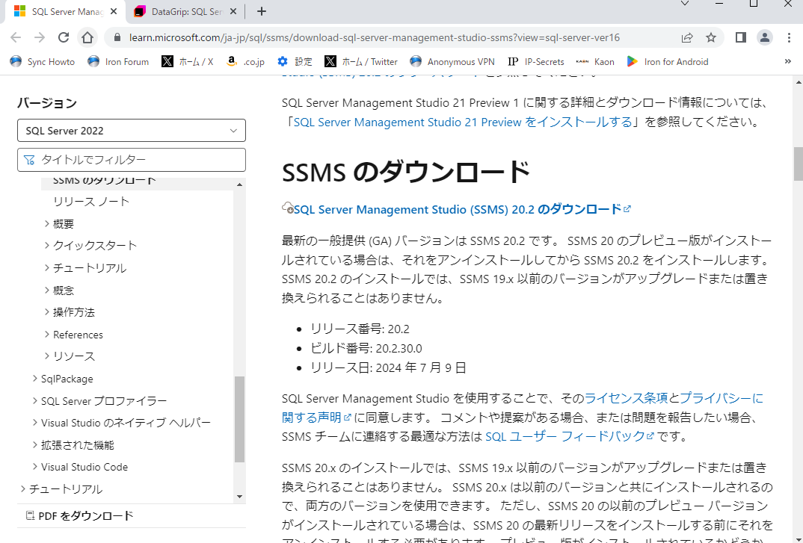
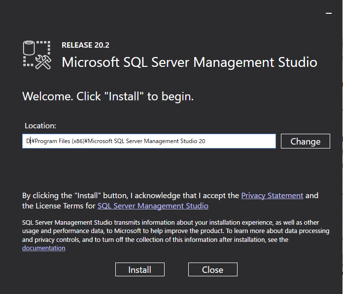
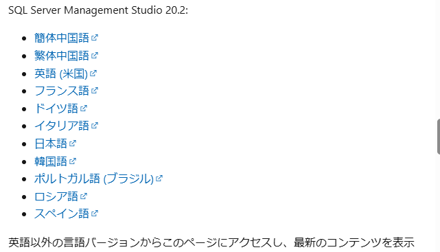
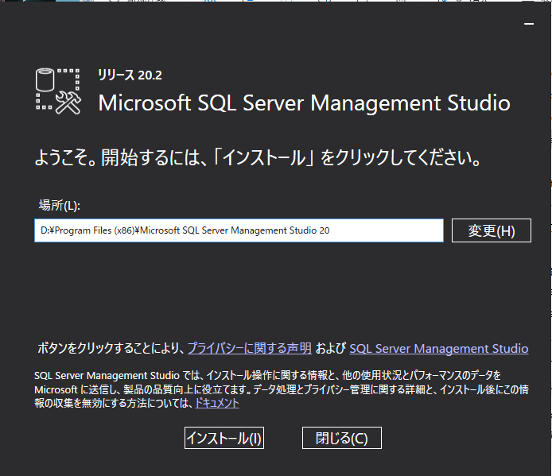

# SQL Server インストール手順

1. ダウンロード  
https://www.microsoft.com/ja-jp/sql-server/sql-server-downloads  
- developer を選択 
  - 
2. インストール
- 基本(B) を選択
  - 
- ライセンス条項に同意する
  - 
- インストール場所を指定する
  - ドライブ指定は任意 
  -   
- インストール完了
  - SSMSのインストールを選択する
  - 引き続き、SSMS インストールへ 
  -   

# SSMS インストール手順
1. ダウンロード  
https://learn.microsoft.com/ja-jp/sql/ssms/download-sql-server-management-studio-ssms?view=sql-server-ver16 
- SQL Server Management Studio (SSMS) 20.2 のダウンロード を選択 
  - 
2. インストール
- Location を指定し、install を選択する
  -   
3. 言語指定
- 日本語 を選択する
  - 
3. 再度インストール
- 日本語化されたことを確認し、インストールを選択する
  - 
 